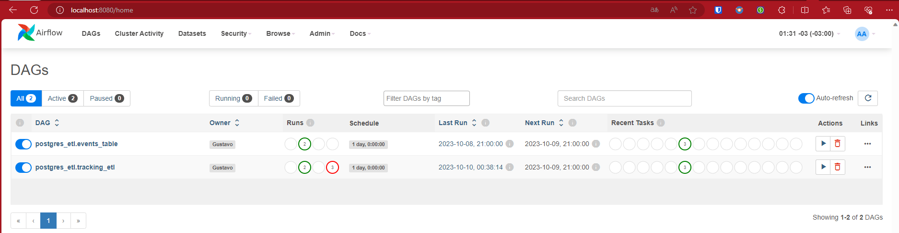
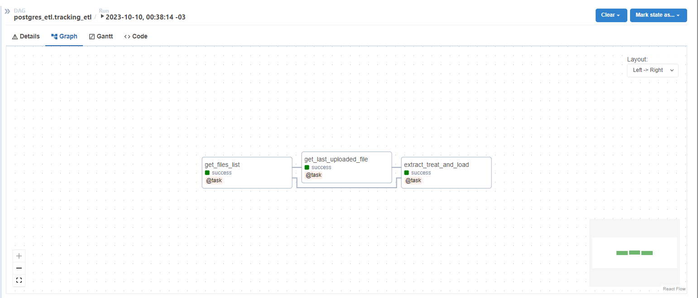

# Airflow-Postgres ETL (Ubuntu/WSL2) <!-- omit in toc -->

Neste projeto, efetuo um ETL de arquivos csv para um banco de dados Postgres utilizando o Airflow. O projeto foi desenvolvido em Ubuntu/WSL2.

---

## Table of Contents <!-- omit in toc -->

- [Estrutura do Repositório](#estrutura-do-repositório)
- [Configurando a Máquina](#configurando-a-máquina)
- [Motivação](#motivação)
- [Estrutura do Projeto](#estrutura-do-projeto)
- [Estrutura das DAGs](#estrutura-das-dags)
- [Rodando o Projeto](#rodando-o-projeto)
- [Queries de teste](#queries-de-teste)
- [Potenciais Problemas a Serem Investigados em Próximas Versões](#potenciais-problemas-a-serem-investigados-em-próximas-versões)
- [Melhorias](#melhorias)
- [Referências](#referências)

---

## Estrutura do Repositório

O projeto está estruturado da seguinte forma:

```txt
airflow-postgres-etl/
├── config-scripts/
│ ├── 01_config_ubuntu_env.sh
│ ├── 02_install_asdf_plugins.sh
│ ├── 03_install_proj_dep.sh
│ ├── 04_requirements_txt_to_poetry(optional).sh
│ ├── stuck_resolving_dependencies_fix.sh
│ └── unistall_env.sh
├── dags/
│ ├── __init__.py
│ ├── .airflowignore
│ ├── datahelper/
│ │ ├── __init__.py
│ │ └── postgres.py
│ └── postgres_etl/
│   ├── events_table.py
│   └── tracking_table.py
├── data/
│ ├── extracted/
│ └── data.zip
├── initial-script/
│ └── extract-zip.py
├── local-run/
├── .gitignore
├── .pre-commit-config.yaml
├── poetry.lock
├── pyproject.toml
├── credentials.json
└── .tool-versions
```

## Configurando a Máquina

- Configure o WSL2 com o seguinte tutorial: <https://github.com/galvsoliveira/airflow-postgres-etl#configuring-wsl2-for-windows-users>
- Clone o repositório e entre na pasta do projeto usando o terminal do Ubuntu.
- Rode os seguintes comandos:
  - `bash config-scripts/01_config_ubuntu_env.sh`
    - Reinicie o terminal e rode: `source ~/.bashrc`.
  - `bash config-scripts/02_install_asdf_plugins.sh`
  - `bash config-scripts/03_install_proj_dep.sh`
- Abra o VSCode usando o comando `code .`.
- Instale o Docker e o Docker Compose.
  - Para WSL2, siga o tutorial: <https://docs.docker.com/desktop/windows/wsl/>.
  - Para Ubuntu, siga o tutorial: <https://docs.docker.com/engine/install/ubuntu/>.
- Renomeie o arquivo `credentials.json.example` para `credentials.json`. As credenciais do exemplo são as mesmas do arquivo `docker-compose.yml`.

## Motivação

O projeto inicialmente tinha o intuito de criar um ETL para o postgres usando containers, mas devido à flexibilidade do Airflow, e a possibilidade de utilização em diferentes projetos, decidi utilizá-lo para o ETL. O Airflow permite que o ETL seja executado em um ambiente de desenvolvimento, e depois seja facilmente migrado para um ambiente de produção, sem a necessidade de alterar o código.

## Estrutura do Projeto

Ciente das limitações de memoria do Airflow, me certifiquei de pesar o mínimo possível, utilizando o Docker para executar o Postgres e o Airflow, e utilizando o PostgresHook para executar as queries no banco de dados e limpando os batches de dados após cada envio para o banco de dados.

Escolhi utilizar a última versão do Airflow disponível no momento, a 2.7.1, e a última versão do Python, a 3.11.5, garanti que as versões do Python no projeto e no Airflow fossem as mesmas, e utilizei o Docker para executar o Airflow e o Postgres. O banco do Postgres utilizado é o mesmo banco do Airflow e para poder acessá-lo, tive que abrir a porta 5432 no arquivo `docker-compose.yml`.

O projeto é composto por duas DAGs, `postgres_etl.events_table` e `postgres_etl.tracking_table`. Cada DAG é responsável por enviar os dados para uma tabela do banco, criando-as se necessário. A DAG `postgres_etl.events_table` é responsável por enviar os dados da tabela `events`, e a DAG `postgres_etl.tracking_table` os dados da tabela `tracking`.

Dividi as colunas entre as tabelas da seguinte forma:

Tracking:

- oid__id: Chave única
- Op: Tipo de Operação da transação
- createdAt: Data de criação do rastreamento
- updatedAt: Data de atualização do rastreamento
- lastSyncTracker: Data da última sincronização do rastreamento
- fileName: Nome do arquivo
- uploadDate: Data de upload do arquivo

Events:

- oid__id: Chave estrangeira
- trackingCode: Código do rastreamento
- description: Descrição do evento
- status: Status do evento
- trackerType: Tipo de rastreamento
- from: Local de origem
- to: Local de destino
- eventCreatedAt: Data de criação do pedido
- uploadDate: Data de upload do arquivo
- fileName: Nome do arquivo

## Estrutura das DAGs

Temos duas funções principais que nos ajudam a entender o funcionamento do ETL:

```python
def send_files_to_postgres(
    files,
    csv_path,
    target_table,
    engine,
    datetime_columns,
    int_columns,
    unique_key,
    filter_columns,
    normalize_column=None,
    n_batch=5,
):
    """Envia os arquivos para uma tabela no banco de dados, criando-a se necessário
    e atualizando os dados se a tabela já existir. O tratamento dos dados é feito
    com as funções process_data.

    Args:
        files: Lista com os nomes dos arquivos
        csv_path: Caminho para os arquivos
        target_table: Nome da tabela alvo
        engine: Conexão com o banco de dados, obtida com PostgresHook
        datetime_columns: Colunas que devem ser do tipo DateTime
        int_columns: Colunas que devem ser do tipo Integer
        unique_key: Nome da chave única
        normalize_column: Lista de colunas que devem ser "explodidas" em linhas
            e normalizadas
        filter_columns: Lista de colunas que devem ser mantidas
    """
    file_counter = 0
    df = pd.DataFrame()
    for file in files:
        file_counter += 1
        print(f"Reading file {file_counter} of {len(files)}")
        temp_df = read_file(file, csv_path)
        df = pd.concat([df, temp_df])
        if file_counter % n_batch == 0 or file_counter == len(files):
            df = process_data(
                df, datetime_columns, unique_key, normalize_column, filter_columns
            )
            columns_dict = create_columns_dict(df, datetime_columns, int_columns)
            create_table_if_not_exists(
                target_table,
                columns_dict,
                engine,
            )
            print("Sending data to postgres...")
            delete_and_insert(target_table, df.to_dict("records"), unique_key, engine)
            rows_inserted = len(df)
            print(f"Data sent successfully. {rows_inserted} rows inserted.")
            df = pd.DataFrame()
    print("All files sent successfully.")
```

```python
@dag.task
def extract_treat_and_load(files, last_uploaded_file):
    """Extrai os dados dos arquivos, trata e carrega no banco de dados"""
    if last_uploaded_file:
        files = [file for file in files if file > last_uploaded_file]
        print("Starting ETL process...")
    send_files_to_postgres(
        files=files,
        csv_path=CSV_PATH,
        target_table=EVENTS_TABLE,
        engine=ENGINE,
        datetime_columns=DATETIME_COLUMNS,
        int_columns=[],
        unique_key=UNIQUE_KEY,
        normalize_column=COLUMN_TO_EXPLODE,
        filter_columns=EVENTS_COLUMNS,
        n_batch=3,
    )
```

Basicamente, checamos todos os arquivos na pasta `data/extracted` e checamos o último arquivo enviado para o banco de dados. Se o último arquivo enviado for o mesmo que o último arquivo na pasta, não fazemos nada. Caso contrário, enviamos os arquivos para o banco de dados a partir do último arquivo enviado. O tratamento dos dados é feito com a função `process_data`, que faz o seguinte:

```python
def process_data(
    df, datetime_columns, unique_key, normalize_column=None, filter_columns=None
):
    """Processa os dados antes de enviá-los para o banco de dados

    Args:
        df: dataframe com os dados
        datetime_columns: colunas que devem ser do tipo DateTime
        unique_key: nome da chave única
        normalize_column (str, optional): coluna que deve ser "explodida" em linhas
        filter_columns (list, optional): colunas que devem ser mantidas

    Returns:
        df: dataframe com os dados processados
    """
    df.drop_duplicates(subset=[unique_key], keep="last")
    if normalize_column:
        df = explode_and_normalize(df, normalize_column)

    # Convert timestamp columns to datetime
    cols_to_fix = set(datetime_columns).intersection(df.columns)
    for col in cols_to_fix:
        if col == "createdAt.$date":
            df.loc[:, col] = pd.to_datetime(df.loc[:, col], unit="ms")
            df = df.rename(columns={col: "orderCreatedAt"})
        else:
            df.loc[:, col] = pd.to_datetime(df.loc[:, col], unit="s")

    # Add column "uploadDate"
    df.loc[:, "uploadDate"] = datetime.now()

    if filter_columns:
        df = df[filter_columns + ["uploadDate", "fileName"]]

    # Remove values that will have error while sending to Postgres
    df = df.replace(
        {"NaN": None, "NaT": None, "None": None, "": None, pd.NaT: None}
    ).drop_duplicates()
    return df
```

A função `process_data` é flexível o bastante para tratar os dados de acordo com as necessidades de cada tabela, permitindo mudar o tipo de colunas, normalizar colunas e filtrar colunas. O replace no final é necessário porque o pandas não consegue converter alguns valores para None, e o Postgres não aceita valores como "NaN" ou "NaT". Atenção: o parâmetro `unique_key` pode ser ambiguo, pois é a chave única da tabela principal antes do explode e não depois.

## Rodando o Projeto

Decidi por subir os csvs para o repositório para facilitar a execução do projeto, mas caso queira extrair os dados do zip, rode o script `initial-script/extract-zip.py`. Para rodar o projeto, siga os seguintes passos:

- No terminal, rode:
  - `cd local-run`, para entrar na pasta local-run.
  - `chmod +x ./local-run`, para dar permissão de execução ao script.
  - `./local-run build-and-start`, pára construir o container do airflow e do postgres e iniciar o projeto. Para parar o projeto, rode `./local-run stop`.

Agora, para acessar o Airflow, abra o navegador e digite `localhost:8080`. O usuário e senha são `airflow`. Rode as DAGs `postgres_etl.events_table` e `postgres_etl.tracking_table` para executar o ETL.



O lineage das DAGs é o seguinte:



## Queries de teste

Para testar o projeto, use as seguintes credenciais do Postgres para fazer a conexão:

```txt
host: localhost
port: 5432
username: airflow
password: airflow
database: postgres
```

Você pode uma extensão do VSCode com id `cweijan.vscode-postgresql-client2` (busque no marketplace de extensões do VSCode) para fazer as queries diretamente no VSCode. Seguem algumas queries de teste:

Total de rastreamentos criados por minuto:

```sql
SELECT
    DATE_TRUNC('minute', "createdAt") AS minute,
    COUNT(*) AS total_rastreamentos
FROM
    public.tracking
GROUP BY
    minute
ORDER BY
    minute
limit 1000
```

Total de eventos por minuto:

```sql
SELECT
    "trackingCode",
    count(*) AS total_eventos
FROM
    public.events
GROUP BY
    1
ORDER BY
    total_eventos DESC
LIMIT 1000;
```

Ranking das 10 descrições mais comuns:

```sql
WITH ranked_events AS (
    SELECT
        "description",
        count(*) AS total_eventos,
        RANK() OVER (ORDER BY count(*) DESC) AS event_rank
    FROM
        public.events
    GROUP BY
        "description"
)
SELECT
    "description",
    total_eventos,
    event_rank
FROM
    ranked_events
WHERE
    event_rank <= 10
ORDER BY
    event_rank;
```

## Potenciais Problemas a Serem Investigados em Próximas Versões

Como fazemos um explode seguido de uma normalização, o número de linhas por arquivo escala bastante, o que faz o envio de dados para o banco de dados demorar muito no caso da tabela de eventos (cerca de 2 horas). Notei também que esse problema de perfomance é devido ao DELETE ser usado antes do INSERT e com diversos parâmetros. Escolhi utilizar esse método pois funciona em qualquer banco de dados, apesar de só depois eu descobrir que o SQLAlchemy não funciona com o Redshift.

Temos 2 opções para resolver o problema de performance, a primeira seria não fazer o DELETE+INSERT e sim um UPSERT mesmo, mas que não consegui fazer funcionar, e a segunda seria mudar a abordagem de um ETL para um ELT, levando os dados brutos diretamente para o banco e fazendo um QUALIFY numa tabela temporaria e inserindo na tabela final com um insert.

## Melhorias

Uma melhoria legal que pode ser feita nesse projeto é a utilização do MongoDB para armazenar os dados brutos, e o Postgres para armazenar os dados tratados. O MongoDB é um banco de dados não relacional, e é muito utilizado para armazenar dados provenientes de Tech, enquanto o Postgres acaba sendo mais utilizado para armazenar dados tratados. O Airflow permite fazer a conexão com o MongoDB e o Postgres, então seria possível fazer essa migração facilmente.

Outra melhoria interessante seria o dbt, que é uma ferramenta de transformação de dados. O dbt permite que as transformações sejam feitas no próprio banco de dados, e também permite a criação de testes automatizados para garantir a qualidade dos dados. Dessa forma, teríamos um ELT, em que os dados brutos são contidos no MongoDB, replicados para o Postgres, e transformados no próprio Postgres com o dbt. Acredito que essa seria uma solução mais escalável e possivelmente mais rápida, já que os dados já estariam dentro do banco e o envio e tratamento não ficariam abrindo e fechando conexões com o banco de dados, além de podermos implementar diversos testes de forma bastante simples com o dbt, garantindo a qualidade dos dados.

## Referências

O projeto foi baseado em um projeto anterior meu (<https://github.com/galvsoliveira/python-poetry-production-level-repository-template>) e nos seguinte tutoriais:
- <https://www.youtube.com/watch?v=mMqaiNbeeUU&t=943s&ab_channel=Codifike>. Para configurar o Airflow e o Postgres.
- <https://essentl.io/running-astronomer-cosmos-in-mwaa/> Para alterar o docker-compose.yml.

Ressalto que também já tinha conhecimento prévio sobre o Airflow em experiências profissionais.
